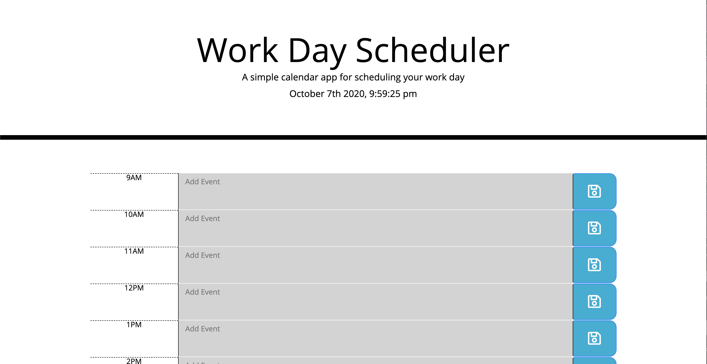
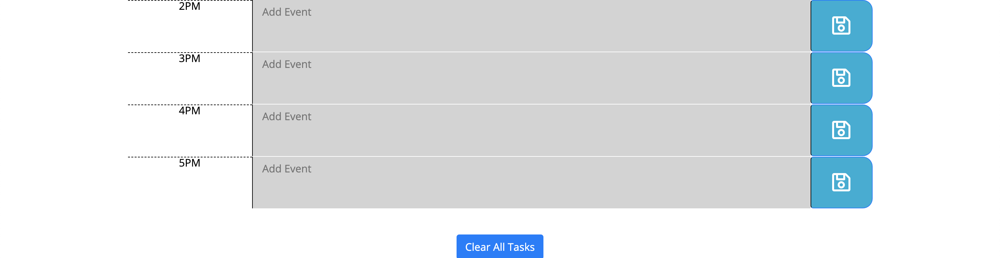

# work-day-scheduler

## Summary
In this assignment, we were given the task of creating a work day scheduler for teams to schedule tasks for every hour block. In order to accomplish this, we were provided `index.html` & `style.css`, so jQuery was used to populate this scheduler dynamically. 

Once an input is added to a row and saved, the task is saved to local storage. Once the page is refreshed the task remains. In addition to the functionality of scheduling tasks, each row is color coded depending on the current time of day. In order to accomplish this feature, I had to reference moment.js and write conditional formulas to dynamically style these rows.

Lastly, I provided a clear button in order to clear the scheduler and clear the stored data from the local storage.

## Instruction

Navigate to the following Github repository:
    https://github.com/hsaddanathan/work-day-scheduler.git

Across the top of the page, click on the Fork button on the right.

Once you have done this, you will see the repo copied within your Github account

Click the Green "Code" Button, and copy repo link. 

Open Terminal and run "git clone (Paste Link Here)"

Once repo has been cloned, you can run " code ." to open in Visual Studio Code. 

From there, right click and select "Open in Default Browser" to preview the page, or you can inspect the code from Visual Studio Code.

Alternatively, if you would like to only view the page please reference:
    https://hsaddanathan.github.io/work-day-scheduler/

## Deployed Site Images

Image shows the top of work day scheduler

Image shows the bottom of work day scheduler

## Links

work-day-scheduler repository link:
    https://github.com/hsaddanathan/work-day-scheduler.git

Github Deployed Site URL:
    https://hsaddanathan.github.io/work-day-scheduler/

## Contributors 
[@hsaddanathan](https://github.com/hsaddanathan)

## License
MIT